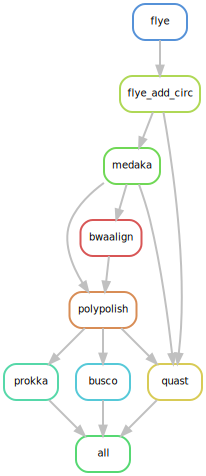

# Nanosake
A Snakemake workflow to perform hybrid assembly using cleaned and trimmed Illumina and Nanopore reads.

## Summary

In short, it performs the following steps:

- Assemble cleaned filtlong nanopore reads with [Flye](https://github.com/fenderglass/Flye) (v2.9.5) assembler.
- Flye-only assembly is then polished with long reads using [Medaka](https://github.com/nanoporetech/medaka)(v1.2.0), followed by polishing with clean trimmed illumina reads using [Polypolish](https://github.com/rrwick/Polypolish) (v0.6.0) to generate Flye+Medaka+Polypolish assembly.
- The Flye-only and Flye+Medaka+Polypolish assemblies the passes through [Prokka](https://github.com/tseemann/prokka) (v1.14.6) for annotation, [BUSCO](https://busco.ezlab.org/) (v5.8.2) for assembly completeness statistics and [QUAST](https://quast.sourceforge.net/) (v5.3.0) for assembly statistics.
- [Multiqc](https://github.com/MultiQC/MultiQC) (v1.28) generates a report on prokka, quast and busco folders as the final step in the workflow. 

The workflow generates all the output in the output `prefix` folder set in the `config.yaml` file. Each workflow steps gets its own individual folder as shown below. **Note that this overview does not capture all possible outputs from each tool; it only highlights the primary directories and _SOME_ of their contents.** 

```
results/2025-04-30_Project_MDHHS_genomics/
├── busco
├── flye
├── medaka
├── multiqc
├── polypolish
├── prokka
└── quast
```


## Installation

> Clone the github directory onto your system.

```

git clone https://github.com/Snitkin-Lab-Umich/Nanosake.git

```

> Ensure you have successfully cloned Nanosake. Type `ls` and you should see the newly created directory **_Nanosake_**. Move to the newly created directory.

```

cd Nanosake

```

> Load bioinformatics, snakemake and singularity modules from Great Lakes modules.

```

module load Bioinformatics snakemake singularity 

```


This workflow makes use of singularity containers available through [State Public Health Bioinformatics group](https://github.com/StaPH-B/docker-builds). If you are working on Great Lakes (umich cluster)—you can load snakemake and singularity modules as shown above. However, if you are running it on your local or other computing platform, ensure you have snakemake and singularity installed.

## Setup config and samples files

**_If you are just testing this pipeline, the config and sample files are already loaded with test data, so you do not need to make any additional changes to them. However, it is a good idea to change the prefix (name of your output folder) in the config file to give you an idea of what variables need to be modified when running your own samples on nanoQC._**

### Customize config.yaml and set tool specific parameters
As an input, the snakemake file takes a config file where you can set the path to `samples.tsv`, path to ONT long reads and illumina short reads, etc. Instructions on how to modify `config/config.yaml` is found in `config.yaml`. 

### Samples

`samples.csv` should be a comma seperated file consisting of two columns—barcode_id(barcode id outputted by Minion or the prefix extracted from your Nanopore reads),sample_id (genome ID—this should be the prefix that is extracted from your illumina fastq reads).

You have to match the Illumina sample with the corresponding Nanopore counterpart and populate `samples.csv` file. Example of the format of `samples.csv` can be found in `config/`. 


## Quick start

### Run Nanosake on a set of samples.

>Preview the steps in Nanosake by performing a dryrun of the pipeline.

```

snakemake -s workflow/Nanosake.smk --dryrun -p

```
>Run the pipeline locally. 

```

snakemake -s workflow/Nanosake.smk -p --configfile config/config.yaml --cores all

```

> Run the pipeline on Great Lakes HPC (the terminal directly—your terminal window will be busy and cannot be used. You would have to open to a new tab to work on the terminal). 

```

snakemake -s workflow/Nanosake.smk -p --use-singularity -j 999 --cluster "sbatch -A {cluster.account} -p {cluster.partition} -N {cluster.nodes}  -t {cluster.walltime} -c {cluster.procs} --mem-per-cpu {cluster.pmem} --output=slurm_out/slurm-%j.out" --cluster-config config/cluster.json --configfile config/config.yaml --latency-wait 1000 --nolock 

```

> Submit Nanosake as a batch job on Great Lakes. 

Change these `SBATCH` commands: `--job-name` to a more descriptive name, `--mail-user` to your email address, `--time` depending on the number of samples you have (should be more than what you specified in `cluster.json`). Feel free to make changes to the other flags if you are comfortable doing so. Once you have made the necessary changes, save the below script as `Nanosake.sbat`. Don't forget to submit nanoQC to Slurm! `sbatch Nanosake.sbat`.

```
#!/bin/bash

#SBATCH --job-name=Nanosake
#SBATCH --mail-user=youremail@umich.edu
#SBATCH --mail-type=BEGIN,END,FAIL,REQUEUE
#SBATCH --export=ALL
#SBATCH --partition=standard
#SBATCH --account=esnitkin1
#SBATCH --nodes=1 --ntasks=1 --cpus-per-task=6 --mem=10g --time=12:15:00

# Load necessary modules
module load Bioinformatics snakemake singularity multiqc

snakemake -s workflow/Nanosake.smk -p --use-singularity -j 999 --cluster "sbatch -A {cluster.account} -p {cluster.partition} -N {cluster.nodes}  -t {cluster.walltime} -c {cluster.procs} --mem-per-cpu {cluster.pmem} --output=slurm_out/slurm-%j.out" --cluster-config config/cluster.json --configfile config/config.yaml --latency-wait 1000 --nolock 

# Extract prefix from config file
PREFIX=$(grep '^prefix:' config/config.yaml | awk '{print $2}')

cd results/${PREFIX}/

multiqc --filename multiqc_report -o multiqc -f prokka/ busco/ quast/ 
 
```

You can generate a MultiQC report on prokka, quast and busco folders after you finish running the snakemake workflow above.




## Dependencies

### Near Essential
* [Snakemake>=7.32.4](https://snakemake.readthedocs.io/en/stable/#)

### Tool stack used in workflow

* [Flye](https://github.com/fenderglass/Flye)
* [Medaka](https://github.com/nanoporetech/medaka)
* [Polypolish](https://github.com/rrwick/Polypolish) 
* [Multiqc](https://github.com/MultiQC/MultiQC)
* [Prokka](https://github.com/tseemann/prokka)
* [BUSCO](https://busco.ezlab.org/)
* [QUAST](https://quast.sourceforge.net/)
* [Pandas](https://pandas.pydata.org/)
* [Numpy](https://numpy.org/)

